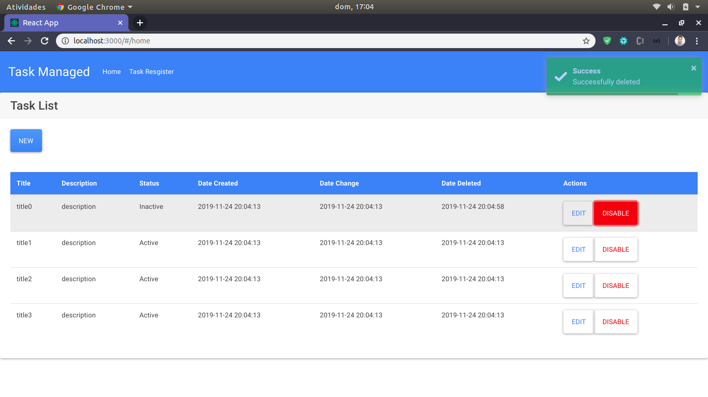
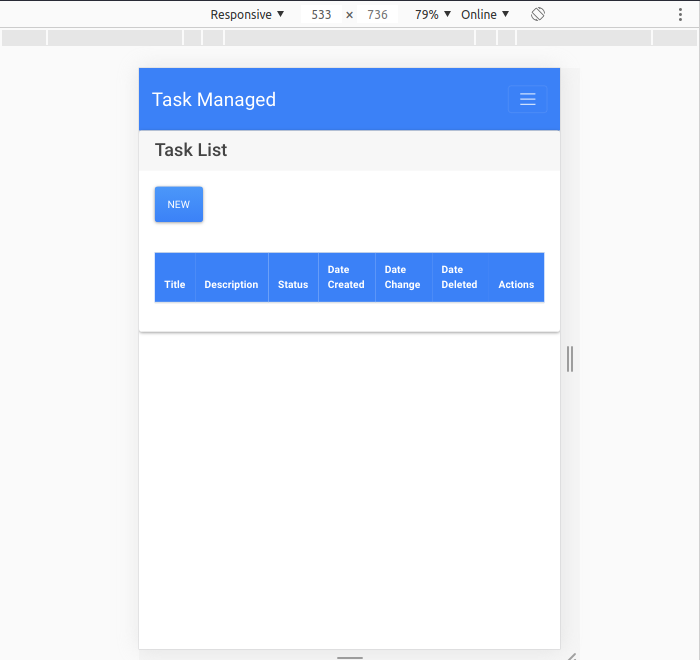
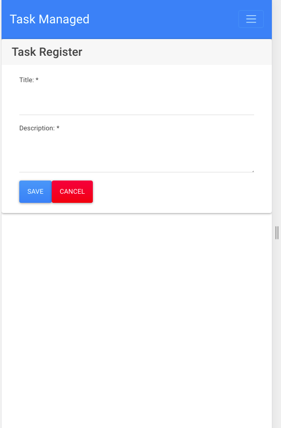

<h2 class="code-line" data-line-start=0 data-line-end=1 >Task Manager System</h2>
<h3 class="code-line" data-line-start=2 data-line-end=3 >Objective:</h3>
<h4 class="code-line" data-line-start=3 data-line-end=4 >This application was developed in order to be able to manage Tasks, being able to register, edit, disable and list various tasks.</h4>
<h3 class="code-line" data-line-start=5 data-line-end=6 >Main Technologies:</h3>
<ul>
<li class="has-line-data" data-line-start="6" data-line-end="7">REACTJS</li>
<li class="has-line-data" data-line-start="7" data-line-end="8">JAVASCRIPT</li>
<li class="has-line-data" data-line-start="8" data-line-end="10">DESIGN BOOTSWATCH</li>
</ul>
<h3 class="code-line" data-line-start=10 data-line-end=11 >Minimum prerequisites:</h3>
<ul>
<li class="has-line-data" data-line-start="11" data-line-end="12">NODE 10</li>
</ul>
<h3 class="code-line" data-line-start=12 data-line-end=13 >Running Application:</h3>
<ul>
<li class="has-line-data" data-line-start="13" data-line-end="14">Clone this project</li>
<li class="has-line-data" data-line-start="14" data-line-end="15">Run the project using the command below.</li>
</ul>
<pre><code class="has-line-data" data-line-start="16" data-line-end="19" class="language-sh">$ npm install
$ npm start
</code></pre>
<h3 class="code-line" data-line-start=20 data-line-end=21 >Testing Application:</h3>

<a href="http://localhost:3000/#/">http://localhost:3000/#/</a>

<h3 class="code-line" data-line-start=23 data-line-end=24 >Project Dependencies:</h3>
<pre><code class="has-line-data" data-line-start="25" data-line-end="61" class="language-sh">{
  "name": "taskapp",
  "version": "0.1.0",
  "private": true,
  "dependencies": {
    "axios": "^0.19.0",
    "bootswatch": "^4.3.1",
    "react": "^16.12.0",
    "react-dom": "^16.12.0",
    "react-router-dom": "^5.1.2",
    "react-scripts": "2.1.8",
    "toastr": "^2.1.4"
  },
  "scripts": {
    "start": "react-scripts start",
    "build": "react-scripts build",
    "test": "react-scripts test",
    "eject": "react-scripts eject"
  },
  "eslintConfig": {
    "extends": "react-app"
  },
  "browserslist": {
    "production": [
      "&gt;0.2%",
      "not dead",
      "not op_mini all"
    ],
    "development": [
      "last 1 chrome version",
      "last 1 firefox version",
      "last 1 safari version"
    ]
  }
}
</code></pre>
<h3 class="code-line" data-line-start=62 data-line-end=63 >Note:</h3>

This application is just the frontend, if you want backend go to

<a href="https://github.com/ThiagoSalvadorFloripa/taskManagementApiRest-SPRINGBOOT-MYSQL
">ACCESS BACKEND!</a>

<h3 class="code-line" data-line-start=64 data-line-end=65 >Version:</h3>

1.0.0

<h3 class="code-line" data-line-start=66 data-line-end=67 >Author:</h3>

Thiago Salvador 

<a href="https://www.linkedin.com/in/thiagocostasalvador/">ACCESS!</a>

<h3 class="code-line" data-line-start=70 data-line-end=71 >License:</h3>

O conteúdo desse projeto, em si, é licenciado sob a licença MIT e propriedade intelectual do autor

